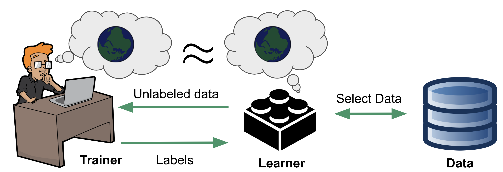

# Exploratory Training: When Annotators Learn About Data

 </img>
This is the official implementation of our paper entitled <a href="https://dl.acm.org/doi/10.1145/3589280">"Exploratory Training: When Annotators Learn About Data" </a>(Slides and presentations are also present in the link). In this paper, we point out the issues present in the current interactive data systems that learn collaboratively with humans. We propose and implement system that collaborate with user to learn accurate model efficiently.

This work builds upon the knowledge and insights gained from our previous work on modeling human learning. Please check the paper <a href="https://dl.acm.org/doi/abs/10.1145/3546930.3547500"> "Exploratory Training: When trainers learn" </a> and its <a href="https://github.com/OSU-IDEA-Lab/collaborative-discovery"> github repo </a> for more information.

## Setup environment

1. Change the current directory to the project directory  
   `cd <project_dir>`
2. Create a new virtual environment.  
   **Note:** Requires python version >= 3.7  
   `virtualenv --python=python3 .venv`
3. Activate virtual environment  
   `source .venv/bin/activate`
4. Install requirements  
   `pip install -r requirements.txt`

## Process and prepare data

**Note:** This requires the raw `*.csv` for each scenario inside `<project_dir>/data/raw-data` folder.

1. Initial parallel precomputation: prepare hypothesis space, process, sample and prepare data for simulation  
   `sh ./prepare_data.sh`

2. Run simulation and plot the figures  
   `sh ./run_simulation.sh`

The results on the learner side are stored in `<project_dir>/learner/store` whereas on the trainer side are stored in `<project_dir>/trainer/trainer-store`. The figures are store in the directory `<project_dir>/figures`.

## BibTeX Citation

If you use our work in a scientific publication, we would appreciate using the following citations:

```
@article{10.1145/3589280,
author = {Shrestha, Rajesh and Habibelahian, Omeed and Termehchy, Arash and Papotti, Paolo},
title = {Exploratory Training: When Annonators Learn About Data},
year = {2023},
issue_date = {June 2023},
publisher = {Association for Computing Machinery},
address = {New York, NY, USA},
volume = {1},
number = {2},
url = {https://doi.org/10.1145/3589280},
doi = {10.1145/3589280},
month = {jun},
articleno = {135},
numpages = {25},
keywords = {human in loop, functional dependencies, Bayesian model, hypothesis-testing model, human learning, data exploration, active learning}
}

@inproceedings{10.1145/3546930.3547500,
author = {Habibelahian, Omeed and Shrestha, Rajesh and Termehchy, Arash and Papotti, Paolo},
title = {Exploratory Training: When Trainers Learn},
year = {2022},
isbn = {9781450394420},
publisher = {Association for Computing Machinery},
address = {New York, NY, USA},
url = {https://doi.org/10.1145/3546930.3547500},
doi = {10.1145/3546930.3547500},
booktitle = {Proceedings of the Workshop on Human-In-the-Loop Data Analytics},
articleno = {3},
numpages = {5},
keywords = {collaborative learning, hypothesis-testing model, human in loop, data exploration, human learning, functional dependencies, bayesian model},
location = {Philadelphia, Pennsylvania},
series = {HILDA '22}
}
```
